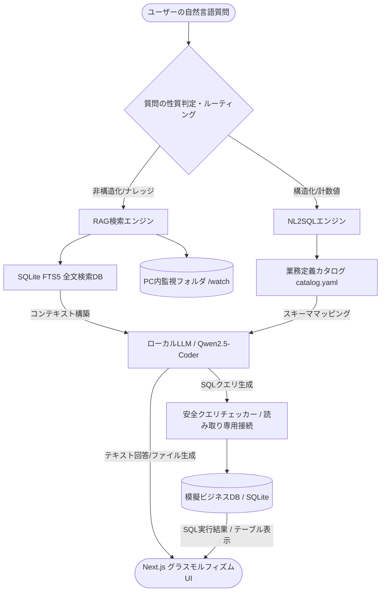

# AVITO フェデレーテッドデータマート設計書

**対象プロジェクト**: スタンドアロン型 AI駆動ナレッジ&データ活用プラットフォーム「AVITO (アビト)」  
**ドキュメントバージョン**: v1.0  
**作成日**: 2026-06-18  

---

## 1. はじめに
本設計書は、社内に分散して存在する「非構造化ドキュメント（PDF、Officeファイル等）」と「構造化データ（会計・販売データベース）」を、大規模なデータレイクの構築や高コストなETL処理を経ずに、ローカル環境で仮想的に結合・クエリ可能にする「フェデレーテッドデータマート（Federated Data Mart）」のアーキテクチャ設計書です。

---

## 2. 仮想統合アーキテクチャ

AVITOでは、物理的に分断されたデータを「業務定義カタログ（catalog.yaml）」と呼ばれる論理レイヤーで架橋し、ローカルAI（LLM）が質問意図に応じてRAG（文書検索）とNL2SQL（データベース照会）に自動的に割り振ることで、ユーザーからは単一のデータマートにアクセスしているように見せる仮想化構造をとっています。



---

## 3. 構成データソースの定義

### 3.1. 構造化データ（販売・会計ドメイン）
*   **物理DB**: SQLite形式（`/data/sqlite/business.db`、本番時はPostgreSQL等を想定）
*   **スキーマ構成**:
    *   **販売ドメイン**: `customers`（顧客）, `products`（商品）, `orders`（受注）, `order_items`（受注明細）
    *   **会計ドメイン**: `accounts`（勘定科目）, `journals`（仕訳ヘッダー）, `journal_lines`（仕訳明細）
*   **論理カタログの定義**:
    *   [catalog.yaml](file:///Users/kurokawamutsuo/開発フォルダ/051_AI文書検索作成Proj/step2/schema_catalog/catalog.yaml) に結合用リレーションキー（例：`orders.customer_id = customers.customer_id`）や、売上（`subtotal = price * quantity`）、利益残高などの業務用語・KPI計算式がマッピングされています。

### 3.2. 非構造化データ（文書・ナレッジドメイン）
*   **物理ディレクトリ**: ローカル共有ディレクトリ（`/watch` 配下）
*   **対応ファイル型**: PDF, Word (`.docx`), Excel (`.xlsx`), PowerPoint (`.pptx`), テキスト
*   **検索基盤**:
    *   `crawler/pc_crawler.py` がファイル追加・変更を即時検知。
    *   `knowledge.db` (FTS5インデックス) にテキストをキャッシュし、高速に全文検索（RAGのコンテキスト化）を行います。

---

## 4. データ仮想化と論理マッピングの仕組み

### 4.1. NLとSQLの架橋
LLMへ入力されるシステムプロンプトに対し、[catalog.yaml](file:///Users/kurokawamutsuo/開発フォルダ/051_AI文書検索作成Proj/step2/schema_catalog/catalog.yaml) からパースされたスキーマ定義および主要KPIの計算例が動的にインジェクションされます。
これにより、ユーザーが「売掛金の回収状況を教えて」と尋ねた際、LLMはカタログ内の `112 (売掛金)` 科目と `111 (現金預金)` 科目の仕訳データを自動的に探索・結合（JOIN）し、貸借差分を算出するSQLを生成します。

### 4.2. クエリ実行とセキュリティ防御
生成された仮想クエリは、`?mode=ro` を付与した読み取り専用接続経由で物理データベースに対して発行されます。これによって、一時的なフェデレーション分析中に書き込みやデータ破壊が発生しないことをシステムレベルで担保しています。

---

## 5. 将来的なマルチDB・フェデレーション拡張

本アーキテクチャは、将来的な複数システム（例：基幹SAP、別部門のPostgreSQL等）の統合を容易にするために、以下の拡張パスを考慮して設計されています。

### 5.1. 複数DBサーバーへの論理的フェデレーション
SQLAlchemyによる抽象化層を採用しているため、接続設定（`.env`）およびカタログ情報を拡張することで、以下の通りマルチ接続が可能です。

```python
# 仮想接続管理の例
engines = {
    "sales": create_engine("postgresql://readonly@sales_db/prod"),
    "accounting": create_engine("mysql+pymysql://readonly@accounting_db/finance")
}
```

### 5.2. カタログの集中管理とマージ
データソースが増加した場合でも、システムコードの改修は不要です。`catalog.yaml` の階層定義に新しいデータベースと結合ルールを追記するだけで、ローカルLLMへの認識コンテキストが更新されます。

---

## 6. まとめ
AVITOのフェデレーテッドデータマートは、データ資産を物理的に一元化するETL型のデータマートに比べ、**「閉域網における極めて高いセキュリティ」「ローカルPCで即時動作する軽量性」「システム結合開発コストの削減」**という明確なアドバンテージを有しています。
